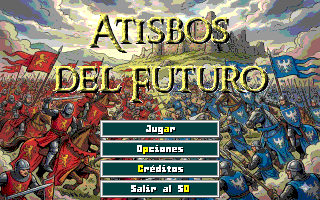
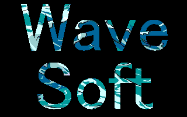

# ATISBOS DEL FUTURO

Atisbos del futuro o Future glimpses es un pequeño juego de estrategia en tiempo real (o RTS) que homenajea a Warcraft / Age of empires, con un poco de cada entre otros.
Pretende ser un ejercicio para ver si era posible hacerlo funcional en un 486DX2/66 con 16MB de RAM, especialmente para el concurso de [MS-DOS Club](https://msdos.club/).

©2026 Wave

\pagebreak

## Historia
Durante siglos, dos reinos han luchado sin descanso.
Ni el acero, ni el fuego, ni el tiempo han logrado
romper el equilibrio.

Pero un día, ambos recibieron la misma visita.

Un viajero del futuro.
Un súbdito de su propio reino.
Un portador de una verdad terrible:
la guerra durará mil años más.

Y, sin embargo, también trajo esperanza.
Con él llegaron secretos del mañana:
nuevas armas, nuevas tácticas y tropas más avanzadas
que este mundo jamás debió conocer.

El equilibrio se rompe.
La historia cambia.
Y la guerra eterna entra en una nueva era.

Son...

Atisbos del futuro

\pagebreak

## Características
* **Agrupación de mapas tipo campaña**: podemos agrupar en carpetas varios mapas simulando una campaña.
* **Multiidioma**: Español / Inglés.
* **Opciones**: podemos ajustar el volumen, el idioma (español / inglés, solo desde el menú principal) o cuándo queremos ver las barras de vida de los enemigos.
* **Minimapa**: el clásico minimapa, podemos desplazarnos por el haciendo clic.
* **Niebla de guerra:** Una vez destapada queda el mapa visible.
* **Grupos de unidades**: podemos asignar grupos del 1 al 5 y tener un acceso rápido sin límite de unidades.
* **Recursos**: tenemos tres recursos, oro, madera y comida. Oro y comida se recolectan con los trabajadores, la comida se obtiene creando nuevas granjas y limita las unidades que podemos tener a la vez.
* **Sistema de mensajes**: para ver mensajes relacionados con los eventos que ocurren.
* **Cola de unidades**: puedes encolar entrenamientos en los edificios y cancelarlos.
* **Pantalla de resultados**: al terminar un mapa tendremos un resumen de datos sobre lo sucedido en la partida.

Y otras sorpresas que será más divertido descubrir jugando.

\pagebreak

## Unidades
`Obrero`: la unidad básica, encargada de la recolección de recursos, la construcción y la reparación.
`Soldado`: la unidad básica de combate cuerpo a cuerpo, sencillo pero eficaz.
`Arquero`: la unidad básica de combate a distancia, permite atacar desde la lejanía.
`Caballero`: una mejora del soldado, mejor en todos los aspectos pero con un coste mayor.
`Mago`: la unidad de ataque a larga distancia, no solo ataca desde muy lejos si no que sus bolas de fuego dañan en área. Cuidado con dañar a tus tropas.

## Edificios
`Alcaldía`: el edificio principal, crea obreros y no puede ser construido.
`Granja`: permite tener más comida para poder tener más unidades simultaneamente.
`Cuarteles`: el edificio básico que permite entrenar soldados, arqueros y caballeros una vez tengan sus edificios.
`Herrería`: permite entrenar arqueros en los cuarteles, requiere tener cuarteles para edificarse
`Establos`: permite entrenar caballeros en los cuarteles, requiere tener herrería para edificarse
`Torre`: permite entrenar magos, requiere tener establos para edificarse.

\pagebreak

## Controles
La mayoría del juego puede controlarse con el ratón, algunos menús tienen atajos de teclado que pueden usarse también.
En el juego principal podemos usar el botón izquierdo para seleccionar una unidad o múltiples y el botón derecho para las acciones contextuales, dependiendo de que unidad elija que objetivo.
Si no queremos usar las acciones contextuales podemos usar los botones de comando de la unidad o sus atajos.

`ALT`: Mostrar barras de vida mientras se pulsa.
`TAB`: Mostrar cantidad restante del recurso sobre el que está el cursor mientras se pulsa.

`SHIFT`: Si estamos en modo construcción, podremos colocar varios edificios a la vez.

`CTRL + 1-5`: Crea un grupo rápido con la selección actual.
`1-5`: Selecciona el grupo rápido creado.

`CTRL + Clic izquierdo`: Añade una unidad a la selección actual.
`SHIFT + Clic izquierdo`: Elimina una unidad a la selección actual.

`Espacio`: Si tienes alguna unidad seleccionada la cámara se posicionará centrando a la primera unidad de la selección.

Nota: No se pueden seleccionar múltiples edificios propios ni múltiples unidades/edificios enemigos.

\pagebreak

## Mapas
Una de las mejores características del juego es la posibilidad de diseñar tus propios mapas. Para ello hará falta el editor [Tiled](https://www.mapeditor.org/) y unas características concretas. En la carpeta /tools/map encontraréis un projecto de tiled con el que gestionarlo todo. Mi recomendación es copiar mapas y editarlos.
### Campañas
Existe la posibilidad de crear "campañas" o conjuntos de mapas, para ello crea una carpeta y pon dentro los mapas que quieras que pertenezcan a ella. Mi recomendación es que empiecen por el número de mapa, ya que los listados se ordenan alfabéticamente.
Además de los mapas, dentro de la carpeta debe haber un fichero "campaign.txt" codificado en UTF-8 con exáctamente dos líneas. La primera es el título (hasta 20 caracteres) y la segunda la descripción, hasta unos 300.
### Unidades personalizadas
Podemos personalizar nuestras unidades, para ello usaremos sus propios atributos. Podemos verlos en "Atributos personalizados" al seleccionar una unidad, podemos crearlos pero es preferible copiarlos de los ejemplos y luego modificarlos.
`CUSTOM`: Activa los atributos personalizados de la unidad.
`MIN_DAMAGE`: Daño mínimo de la unidad.
`MAX_DAMAGE`: Daño máximo de la unidad.
`MAX_HEALTH`: Salud máxima de la unidad.
`ARMOR`: La armadura de la unidad.
`MUST_SURVIVE`: Indica que esta unidad debe sobrevivir, si muere será una derrota instantánea.
`Nombre`: No es una variable, es el nombre del objeto de Tiled, hasta unos 10 caracteres.

\pagebreak

### Atributos de los mapas
Además de poder editar el terreno, tenemos la posibilidad de configurar algunas cosas para hacer los mapas únicos. A nivel de mapa, los encontraréis en "Mapa -> Atributos del mapa... -> Atributos personalizados"
Son los siguientes:
`AI_MODE`: El modo de funcionamiento de la IA, hay tres opciones.

* `IDLE`, la máquina no hace nada pero se defenderá.
* `PASSIVE`, la máquina recogerá recursos, creará su ejército y reconstruirá sus edificios, pero solo se defenderá.
* `AGGRESIVE`, lo mismo que `PASSIVE` pero además enviará oleadas de enemigos a por ti.

`ENABLE_BARRACKS`: Activa la construcción de cuarteles en el mapa.
`ENABLE_BLACKSMITH`: Activa la construcción de herrerías en el mapa.
`ENABLE_STABLES`: Activa la construcción de establos en el mapa.
`ENABLE_TOWER`: Activa la construcción de torres en el mapa.

`ENABLE_UPGRADE_SOLDIER`: Activa la opción de mejorar soldados.
`ENABLE_UPGRADE_ARCHER`: Activa la opción de mejorar arqueros.
`ENABLE_UPGRADE_KNIGHT`: Activa la opción de mejorar caballeros.
`ENABLE_UPGRADE_MAGE`: Activa la opción de mejorar magos.

`UPGRADED_SOLDIER_PLAYER`: Si el jugador tiene los soldados mejorados.
`UPGRADED_ARCHER_PLAYER`: Si el jugador tiene los arqueros mejorados.
`UPGRADED_KNIGHT_PLAYER`: Si el jugador tiene los caballeros mejorados.
`UPGRADED_MAGE_PLAYER`: Si el jugador tiene los magos mejorados.

`UPGRADED_SOLDIER_COMPUTER`: Si el ordenador tiene los soldados mejorados.
`UPGRADED_ARCHER_COMPUTER`: Si el ordenador tiene los arqueros mejorados.
`UPGRADED_KNIGHT_COMPUTER`: Si el ordenador tiene los caballeros mejorados.
`UPGRADED_MAGE_COMPUTER`: Si el ordenador tiene los magos mejorados.

`MSG_TITLE`: El título del mapa, se verá en el selector y en la información del mapa en partida, unos 20 caracteres.
`MSG_DESCRIPTION`: El mensaje de descripción del mapa, para el selector de niveles y la información del menú de pausa, unos caracteres.
`MSG_LOSE`: El mensaje que aparecerá al perder el mapa, unos 150 caracteres.
`MSG_WIN`: El mensaje que aparecerá al ganar el mapa, unos 150 caracteres.

`PEACE_TIME`: El tiempo en segundos que tardará la máquina en empezar a crear unidades y mandártelas, solo tiene sentido en modo `AGGRESSIVE`.

`RES_GOLD_COMPUTER`: El oro inicial con el que empieza la máquina.
`RES_GOLD_PLAYER`: El oro inicial con el que empieza el jugador.
`RES_WOOD_COMPUTER`: La madera inicial con la que empieza la máquina.
`RES_WOOD_PLAYER`: La madera inicial con la que empieza el jugador.

\pagebreak

## Créditos
**Programación y diseño**: Wave
**Con ayuda de IA**: texturas, edificios, ilustración del título, acciones.

**Créditos de recursos de terceros**:
Contenido modificado de "[Bitrimus Font](https://ggbot.itch.io/bitrimus-font)" por [GGBotNet](https://www.ggbot.net), licenciado bajo [CC0 1.0 Universal](https://creativecommons.org/publicdomain/zero/1.0/).

Contenido modificado de "[Fantasy Battle Pack](https://mattwalkden.itch.io/fantasy-battle-pack)" por [Matt Walkden](https://mattwalkden.itch.io).

Contenido modificado de "[Superpowers assets sound effects](https://opengameart.org/content/superpowers-assets-sound-effects)" - "medieval-fantasyy/5.wav (goldhit.wav)", "western-fps-2d/explosion-1.ogg (fbexplo.wav)", "medieval-fantasy/7.wav (ironhit.wav)", "prehistoric-platformer/hit-1.wav (work.wav)", "prehistoric-platformer/wood-2.wav (chop.wav)", "medieval-fantasyy/woosh-2.wav (arrowthr.wav)",
"space-shooter/alert.wav (attack.wav)", "ninja-adventure/menu-1.ogg (notvalid.wav)", "prehistoric-platformer/hit-2.wav (crumble.wav)", "top-down-shooter/flame-thrower.wav (fblaunch.wav)", "western-fps-2d/arrow.ogg (arrowhit.wav)" y "western-fps-2d/scream-5.ogg (die.wav)" por [Sparklin Labs - Superpowers HTML5 game maker](http://superpowers-html5.com/), licenciado bajo [CC0 1.0 Universal](https://creativecommons.org/publicdomain/zero/1.0/).

Contenido de "[DarkBasic Music Library](https://opengameart.org/content/darkbasic-music-library)" - "northern lights.mid (map1.mid)" y "~bog~ tune.mid (menus.mid)" por [DarkBasic](https://darkbasic.com/), licenciado bajo [CC-BY-4.0+](https://creativecommons.org/licenses/by/4.0/).

Contenido de "[Midi Pack 3 (35 so far)](https://opengameart.org/content/midi-pack-3-35-so-far)" - "9088malchakwilder8.mid (intro.mid)", "9095noobusfog.mid (defeat.mid)", "9099clavvictorytune.mid (victory.mid)", "9101pianochordmelody.mid (map2.mid)" y "9094telosvillagecentralsmarket.mid (map3.mid)" por [Tozan](https://opengameart.org/users/tozan), licenciado bajo [CC0 1.0 Universal](https://creativecommons.org/publicdomain/zero/1.0/).

Se ha usado [Cool Text Graphics Generator](https://cooltext.com/) para generar el título del juego.

