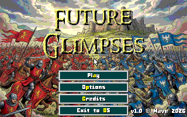
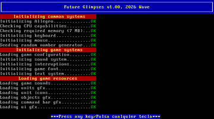
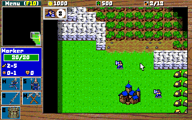
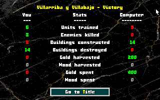
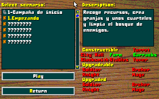

FUTURE GLIMPSES v1.0

Future glimpses is a small real-time strategy (or RTS) game that pays homage to Warcraft / Age of Empires, blending elements from both among others.
It aims to be an exercise to see if it was possible to make it functional on a 486DX2/66 with 16MB of RAM, especially for the [MS-DOS Club](https://msdos.club/) contest.

©2026 Wave

\pagebreak

## Story

For centuries, two kingdoms have fought relentlessly.
Neither steel, nor fire, nor time has managed to
break the balance.

But one day, both received the same visitor.

A traveler from the future.
A subject of his own kingdom.
A bearer of a terrible truth:
the war will last a thousand more years.

And yet, he also brought hope.
With him came secrets of tomorrow:
new weapons, new tactics, and troops more advanced
than this world should ever know.

The balance is broken.
History changes.
And the eternal war enters a new era.

They are...

Future Glimpses

\pagebreak

## Features

* **Campaign-style map grouping**: We can group several maps into folders simulating a campaign.
* **Multilingual**: Spanish / English.
* **Options**: We can adjust volume, language (Spanish / English (only interface, not maps), main menu only), health bars and game speed.
* **Minimap**: The classic minimap, we can navigate through it by clicking.
* **Fog of war:** Once uncovered, the map remains visible.
* **Unit groups**: We can assign groups from 1 to 5 and have quick access with no unit limit.
* **Resources**: We have three resources: gold, wood, and food. Gold and wood are gathered by workers, food is obtained by building new farms or town halls and limits the maximum units we can have at once.
* **Message system**: To view messages related to occurring events.
* **Unit queue**: You can queue training in buildings and cancel them.
* **Idle workers**: When a worker has been idle for a while, you can quickly jump to them using an on-screen button. You can cycle between different workers by clicking if there is more than one.
* **Results screen**: Upon completing a map, we will get a summary of data about what happened during the game.

And other surprises that will be more fun to discover while playing.

\pagebreak

## Units

**Worker**: Unit for gathering resources, constructing, and repairing.
**Soldier**: Basic melee combat unit.
**Archer**: Basic ranged combat unit.
**Knight**: Faster and more powerful melee unit.
**Mage**: Long-range attack unit; additionally, fireballs deal area-of-effect damage. Be careful not to damage your own troops.

## Buildings

**City Hall**: The main building, creates workers and adds food.
**Farm**: Allows having more food to support more units.
**Barracks**: The basic building that allows training soldiers, archers, and knights once their required buildings exist.
**Blacksmith**: Allows training archers at the barracks and upgrading archers and soldiers; requires barracks.
**Stables**: Allows training knights at the barracks and upgrading knights; requires blacksmith.
**Tower**: Allows training and upgrading mages; requires stables.
**Turret**: Building that attacks enemies with arrows; requires blacksmith.

\pagebreak

## Controls

Most of the game can be controlled with the mouse, though some menus also have keyboard shortcuts that can be used.
In the main game, we can use the left button to select one or multiple units, and the right button for contextual actions, depending on which unit chooses which target.
If we don't want to use contextual actions, we can use the unit's command buttons or their shortcuts.

**ALT**: Hold to show health bars.

**TAB**: Hold to show remaining amount of resource under the cursor.

**F1**: Cycle through idle workers.

**SHIFT**: In build mode, allows placing multiple buildings at once.

**CTRL + 1-5**: Creates a quick group with the current selection.
**1-5**: Selects the created quick group. Pressing twice centers the camera on the first unit of the selection.

**CTRL + Left Click**: Adds a unit to the current selection.
**SHIFT + Left Click**: Removes a unit from the current selection.

**Space**: If you have any units selected, the camera will center on the first unit of the selection.

\pagebreak

**Right Click**: Contextual action; depending on the selection and target, it will perform a different action.

| Unit | Target | Result |
|-------------------------------|---------------------------|------------------------------------------|
| Worker/s | Tile with resource | Send to work |
| Unit/s | Empty tile without resource | Move unit to target |
| Attacking unit/s or building | Tile with enemy | Move unit to attack target |
| Unit training building | Any tile | Set rally point for trained units |

**Note**: You cannot select multiple owned buildings or multiple enemy units/buildings.

\pagebreak

## Maps

One of the best features of the game is the ability to design your own maps. To do so, you will need the [Tiled](https://www.mapeditor.org/) editor and specific settings. In the /tools/map folder, you will find a Tiled project to manage everything. My recommendation is to copy existing maps and edit them.
Once completed, they must be exported as **Future Glimpses Map (fgm)** using the included plugin, which will be usable from the maps folder.

### Campaigns

You can create "campaigns" or sets of maps; to do so, create a folder and place inside it the maps you want to belong to it. My recommendation is to start map names with numbers, as lists are sorted alphabetically.
Inside the folder, there must be a "campaign.txt" file encoded in UTF-8 with two lines: Title (up to 20 characters) and Description (up to around 300 characters).

\pagebreak

### Custom Units

We can customize our units using their attributes. We can view them under "Custom Attributes" when selecting a unit; we can create them, but it is preferable to copy them from examples and then modify them.
**CUSTOM**: Enables custom attributes for the unit.
**MIN_DAMAGE**: Minimum damage of the unit.
**MAX_DAMAGE**: Maximum damage of the unit.
**MAX_HEALTH**: Maximum health of the unit.
**ARMOR**: The unit's armor.
**MUST_SURVIVE**: Indicates that this unit must survive; if it dies, it results in instant defeat.
**Name**: Not a variable, it is the name of the Tiled object, up to about 10 characters.

\pagebreak

### Map Attributes

In addition to editing the terrain, we can configure several options to make maps unique. At the map level, you can find them in "Map -> Map Properties... -> Custom Properties", as follows:
**AI_MODE**: The AI operation mode; there are three options:

* **IDLE**: Does not move, but defends itself.
* **PASSIVE**: Gathers resources, builds its army, rebuilds buildings, and defends itself.
* **AGGRESIVE**: Same as **PASSIVE**, plus sends waves of enemies after you.

**ENABLE_BARRACKS**: Barracks buildable on the map.
**ENABLE_BLACKSMITH**: Blacksmiths buildable on the map.
**ENABLE_CITY_HALL**: Town Halls buildable on the map.
**ENABLE_FARM**: Farms buildable on the map.
**ENABLE_STABLES**: Stables buildable on the map.
**ENABLE_TOWER**: Towers buildable on the map.
**ENABLE_TURRET**: Turrets buildable on the map.

**ENABLE_UPGRADE_SOLDIER**: Soldier upgrade available.
**ENABLE_UPGRADE_ARCHER**: Archer upgrade available.
**ENABLE_UPGRADE_KNIGHT**: Knight upgrade available.
**ENABLE_UPGRADE_MAGE**: Mage upgrade available.

**UPGRADED_SOLDIER_PLAYER**: Upgraded soldiers for player.
**UPGRADED_ARCHER_PLAYER**: Upgraded archers for player.
**UPGRADED_KNIGHT_PLAYER**: Upgraded knights for player.
**UPGRADED_MAGE_PLAYER**: Upgraded mages for player.

**UPGRADED_SOLDIER_COMPUTER**: Upgraded soldiers for computer.
**UPGRADED_ARCHER_COMPUTER**: Upgraded archers for computer.
**UPGRADED_KNIGHT_COMPUTER**: Upgraded knights for computer.
**UPGRADED_MAGE_COMPUTER**: Upgraded mages for computer.

**MSG_TITLE**: Map title, displayed in level selector and in-game map info, about 20 characters.
**MSG_DESCRIPTION**: Map description message for level selector and pause menu info, about 150 characters.
**MSG_LOSE**: Message displayed upon losing the map, about 150 characters.
**MSG_WIN**: Message displayed upon winning the map, about 150 characters.

**PEACE_TIME**: Time in seconds before the computer starts sending units at you; halfway through, it starts training them. Only relevant in **AGGRESSIVE** mode.

**RES_GOLD_COMPUTER**: Starting gold for the computer.
**RES_GOLD_PLAYER**: Starting gold for the player.
**RES_WOOD_COMPUTER**: Starting wood for the computer.
**RES_WOOD_PLAYER**: Starting wood for the player.

**MAP_CODE**: Unlock code for this map; another map in this campaign must have been completed with this code as its **WIN_CODE** to play it.
**WIN_CODE**: Code unlocked upon winning. Unlocks maps in the campaign that have this **WIN_CODE** set as their **MAP_CODE**.

\pagebreak

## Credits

**Programming and Design**: Wave
**With AI Assistance**: Textures, buildings, title illustration, actions.
**Third-Party Asset Credits**:
[Bitrimus Font](https://ggbot.itch.io/bitrimus-font) by [GGBotNet](https://www.ggbot.net), licensed under [CC0 1.0 Universal](https://creativecommons.org/publicdomain/zero/1.0/).

[Fantasy Battle Pack](https://mattwalkden.itch.io/fantasy-battle-pack) by [Matt Walkden](https://mattwalkden.itch.io) (tileset modified by [@RubenRetro](https://rubenretro.itch.io/)).

[Superpowers assets sound effects](https://opengameart.org/content/superpowers-assets-sound-effects) - "medieval-fantasyy/5.wav (goldhit.wav)", "western-fps-2d/explosion-1.ogg (fbexplo.wav)", "medieval-fantasy/7.wav (ironhit.wav)", "prehistoric-platformer/hit-1.wav (work.wav)", "prehistoric-platformer/wood-2.wav (chop.wav)", "medieval-fantasyy/woosh-2.wav (arrowthr.wav)",
"space-shooter/alert.wav (attack.wav)", "ninja-adventure/menu-1.ogg (notvalid.wav)", "prehistoric-platformer/hit-2.wav (crumble.wav)", "top-down-shooter/flame-thrower.wav (fblaunch.wav)", "western-fps-2d/arrow.ogg (arrowhit.wav)" and "western-fps-2d/scream-5.ogg (die.wav)" by [Sparklin Labs - Superpowers HTML5 game maker](http://superpowers-html5.com/), licensed under [CC0 1.0 Universal](https://creativecommons.org/publicdomain/zero/1.0/).

[DarkBasic Music Library](https://opengameart.org/content/darkbasic-music-library) - "northern lights.mid (map1.mid)" and "\~bog\~ tune.mid (menus.mid)" by [DarkBasic](https://darkbasic.com/), licensed under [CC-BY-4.0+](https://creativecommons.org/licenses/by/4.0/).

[Midi Pack 3 (35 so far)](https://opengameart.org/content/midi-pack-3-35-so-far) - "9088malchakwilder8.mid (intro.mid)", "9095noobusfog.mid (defeat.mid)", "9099clavvictorytune.mid (victory.mid)", "9101pianochordmelody.mid (map2.mid)" and "9094telosvillagecentralsmarket.mid (map3.mid)" by [Tozan](https://opengameart.org/users/tozan), licensed under [CC0 1.0 Universal](https://creativecommons.org/publicdomain/zero/1.0/).

[Cool Text Graphics Generator](https://cooltext.com/) for the title.

