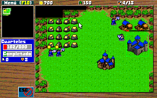
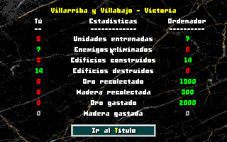
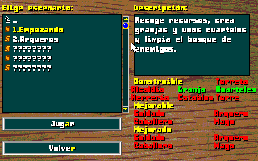

# ATISBOS DEL FUTURO v1.0

Atisbos del futuro o Future glimpses es un pequeño juego de estrategia en tiempo real (o RTS) que homenajea a Warcraft / Age of empires, con un poco de cada entre otros.
Pretende ser un ejercicio para ver si era posible hacerlo funcional en un 486DX2/66 con 16MB de RAM, especialmente para el concurso de [MS-DOS Club](https://msdos.club/).

©2026 Wave

\pagebreak

## Historia

Durante siglos, dos reinos han luchado sin descanso.
Ni el acero, ni el fuego, ni el tiempo han logrado
romper el equilibrio.

Pero un día, ambos recibieron la misma visita.

Un viajero del futuro.
Un súbdito de su propio reino.
Un portador de una verdad terrible:
la guerra durará mil años más.

Y, sin embargo, también trajo esperanza.
Con él llegaron secretos del mañana:
nuevas armas, nuevas tácticas y tropas más avanzadas
que este mundo jamás debió conocer.

El equilibrio se rompe.
La historia cambia.
Y la guerra eterna entra en una nueva era.

Son...

Atisbos del futuro

\pagebreak

## Características

* **Agrupación de mapas tipo campaña**: Podemos agrupar en carpetas varios mapas simulando una campaña.
* **Multiidioma**: Español / Inglés.
* **Opciones**: Podemos ajustar el volumen, el idioma (español / inglés (solo interficie, no mapas), solo desde el menú principal), las barras de vida o la velocidad del juego.
* **Minimapa**: El clásico minimapa, podemos desplazarnos por él haciendo clic.
* **Niebla de guerra:** Una vez destapada queda el mapa visible.
* **Grupos de unidades**: Podemos asignar grupos del 1 al 5 y tener un acceso rápido sin límite de unidades.
* **Recursos**: Tenemos tres recursos, oro, madera y comida. Oro y madera se recolectan con los trabajadores, la comida se obtiene creando nuevas granjas o alcaldías y limita las unidades que podemos tener a la vez.
* **Sistema de mensajes**: Ppara ver mensajes relacionados con los eventos que ocurren.
* **Cola de unidades**: Puedes encolar entrenamientos en los edificios y cancelarlos.
* **Obreros vagos**: Cuando un obrero lleve un tiempo sin trabajar podrás ir rápidamente a él con un botón en pantalla. Podrás pasar entre diferentes obreros haciendo clic en caso de haber más de uno.
* **Pantalla de resultados**: Al terminar un mapa tendremos un resumen de datos sobre lo sucedido en la partida.

Y otras sorpresas que será más divertido descubrir jugando.

\pagebreak

## Unidades

**Obrero**: Unidad para recolectar recursos, construir y reparar.
**Soldado**: Unidad básica de combate cuerpo a cuerpo.
**Arquero**: Unidad básica de combate a distancia.
**Caballero**: Unidad cuerpo a cuerpo más rápida y poderosa.
**Mago**: Unidad de ataque a larga distancia, además bolas de fuego dañan en área. Cuidado con dañar a tus tropas.

## Edificios

**Alcaldía**: El edificio principal, crea obreros y añade comida.
**Granja**: Permite tener más comida para poder tener más unidades.
**Cuarteles**: El edificio básico que permite entrenar soldados, arqueros y caballeros una vez tengan sus edificios.
**Herrería**: Permite entrenar arqueros en los cuarteles y mejorar arqueros y soldados, requiere cuarteles.
**Establos**: Permite entrenar caballeros en los cuarteles y mejorar caballeros, la herrería.
**Torre**: Permite entrenar y mejorar magos, requiere los establos.
**Torreta**: Edificio que ataca con flechas a los enemigos, requiere la herrería.

\pagebreak

## Controles

La mayoría del juego puede controlarse con el ratón, algunos menús tienen atajos de teclado que pueden usarse también.
En el juego principal podemos usar el botón izquierdo para seleccionar una unidad o múltiples y el botón derecho para las acciones contextuales, dependiendo de que unidad elija que objetivo.
Si no queremos usar las acciones contextuales podemos usar los botones de comando de la unidad o sus atajos.

**ALT**: Mostrar barras de vida mientras se pulsa.

**TAB**: Mostrar cantidad restante del recurso sobre el que está el cursor mientras se pulsa.

**F1**: Iterar entre los obreros vagos.

**SHIFT**: Si estamos en modo construcción, podremos colocar varios edificios a la vez.

**CTRL + 1-5**: Crea un grupo rápido con la selección actual.
**1-5**: Selecciona el grupo rápido creado. Si se pulsa dos veces coloca la cámara sobre la primera unidad de la selección.

**CTRL + Clic izquierdo**: Añade una unidad a la selección actual.
**SHIFT + Clic izquierdo**: Elimina una unidad a la selección actual.

**Espacio**: Si tienes alguna unidad seleccionada la cámara se posicionará centrando a la primera unidad de la selección.

\pagebreak

**Clic derecho**: Acción contextual, dependiendo de lo seleccionado y el destino, hará una acción diferente.

| Unidad                        | Objetivo                  | Resultado                                |
|-------------------------------|---------------------------|------------------------------------------|
| Obrero/s | Celda con recurso | Envía a trabajar |
| Unidad/es | Celda vacía sin recurso | Mueve a la unidad al objetivo |
| Unidad/es o edificio que ataca | Celda con enemigo | Mueve a la unidad a atacar al objetivo |
| Edificio que entrena unidades | Cualquier celda | Crea un punto de reunión para entrenados |

**Nota**: No se pueden seleccionar múltiples edificios propios ni múltiples unidades/edificios enemigos.

\pagebreak

## Mapas

Una de las mejores características del juego es la posibilidad de diseñar tus propios mapas. Para ello hará falta el editor [Tiled](https://www.mapeditor.org/) y unas características concretas. En la carpeta /tools/map encontraréis un projecto de tiled con el que gestionarlo todo. Mi recomendación es copiar mapas y editarlos.
Una vez se tengan completados, hay que exportarlos como **Future Glimpses Map (fgm)** usando el plugin incluido que será usable desde la carpeta de mapas.

### Campañas

Pueden crearse "campañas" o conjuntos de mapas, para ello crea una carpeta y pon dentro los mapas que quieras que pertenezcan a ella. Mi recomendación es que empiecen por el número de mapa, ya que los listados se ordenan alfabéticamente.
Dentro de la carpeta debe haber un fichero "campaign.txt" codificado en UTF-8 con dos líneas. Título (hasta 20 caracteres) y descripción (hasta unos 300).

\pagebreak

### Unidades personalizadas

Podemos personalizar nuestras unidades, para ello usaremos sus propios atributos. Podemos verlos en "Atributos personalizados" al seleccionar una unidad, podemos crearlos pero es preferible copiarlos de los ejemplos y luego modificarlos.
**CUSTOM**: Activa los atributos personalizados de la unidad.
**MIN_DAMAGE**: Daño mínimo de la unidad.
**MAX_DAMAGE**: Daño máximo de la unidad.
**MAX_HEALTH**: Salud máxima de la unidad.
**ARMOR**: La armadura de la unidad.
**MUST_SURVIVE**: Indica que esta unidad debe sobrevivir, si muere será una derrota instantánea.
**Nombre**: No es una variable, es el nombre del objeto de Tiled, hasta unos 10 caracteres.

\pagebreak

### Atributos de los mapas

Además de poder editar el terreno, tenemos la posibilidad de configurar algunas cosas para hacer los mapas únicos. A nivel de mapa, los encontraréis en "Mapa -> Atributos del mapa... -> Atributos personalizados", son los siguientes:
**AI_MODE**: El modo de funcionamiento de la IA, hay tres opciones.

* **IDLE**: No se mueve, pero se defiende.
* **PASSIVE**: Recoge recursos, crea su ejército, reconstruye edificios y se defiende.
* **AGGRESIVE**: Como **PASSIVE** y además envía oleadas de enemigos a por ti.

**ENABLE_BARRACKS**: Cuarteles construibles en el mapa.
**ENABLE_BLACKSMITH**: Herrerías construibles en el mapa.
**ENABLE_CITY_HALL**: Alcaldías construibles en el mapa.
**ENABLE_FARM**: Granjas construibles en el mapa.
**ENABLE_STABLES**: Establos construibles en el mapa.
**ENABLE_TOWER**: Torres construibles en el mapa.
**ENABLE_TURRET**: Torretas construibles en el mapa.

**ENABLE_UPGRADE_SOLDIER**: Mejora de soldados disponible.
**ENABLE_UPGRADE_ARCHER**: Mejora de arqueros disponible.
**ENABLE_UPGRADE_KNIGHT**: Mejora de caballeros disponible.
**ENABLE_UPGRADE_MAGE**: Mejora de magos disponible.

**UPGRADED_SOLDIER_PLAYER**: Soldados mejorados para el jugador.
**UPGRADED_ARCHER_PLAYER**: Arqueros mejorados para el jugador.
**UPGRADED_KNIGHT_PLAYER**: Caballeros mejorados para el jugador.
**UPGRADED_MAGE_PLAYER**: Magos mejorados para el jugador.

**UPGRADED_SOLDIER_COMPUTER**: Soldados mejorados para la máquina.
**UPGRADED_ARCHER_COMPUTER**: Arqueros mejorados para la máquina.
**UPGRADED_KNIGHT_COMPUTER**: Caballeros mejorados para la máquina.
**UPGRADED_MAGE_COMPUTER**: Magos mejorados para la máquina.

**MSG_TITLE**: El título del mapa, se verá en el selector y en la información del mapa en partida, unos 20 caracteres.
**MSG_DESCRIPTION**: El mensaje de descripción del mapa, para el selector de niveles y la información del menú de pausa, unos 150 caracteres.
**MSG_LOSE**: El mensaje que aparecerá al perder el mapa, unos 150 caracteres.
**MSG_WIN**: El mensaje que aparecerá al ganar el mapa, unos 150 caracteres.

**PEACE_TIME**: El tiempo en segundos que tardará la máquina en empezar mandarte unidades, a la mitad del tiempo empezará a entrenarlas, solo tiene sentido en modo **AGGRESSIVE**.

**RES_GOLD_COMPUTER**: El oro inicial con el que empieza la máquina.
**RES_GOLD_PLAYER**: El oro inicial con el que empieza el jugador.
**RES_WOOD_COMPUTER**: La madera inicial con la que empieza la máquina.
**RES_WOOD_PLAYER**: La madera inicial con la que empieza el jugador.

**MAP_CODE**: Este es el código de desbloqueo del mapa, necesitará haberse completado otro mapa en esta campaña que tenga como **WIN_CODE** este código para poder jugarlo.
**WIN_CODE**: Código desbloqueado al ganar. Desbloquea los mapas de la campaña que tengan como **MAP_CODE** este **WIN_CODE**.

\pagebreak

## Créditos

**Programación y diseño**: Wave
**Con ayuda de IA**: texturas, edificios, ilustración del título, acciones.
**Créditos de recursos de terceros**:
[Bitrimus Font](https://ggbot.itch.io/bitrimus-font) por [GGBotNet](https://www.ggbot.net), licenciado bajo [CC0 1.0 Universal](https://creativecommons.org/publicdomain/zero/1.0/).

[Fantasy Battle Pack](https://mattwalkden.itch.io/fantasy-battle-pack) por [Matt Walkden](https://mattwalkden.itch.io) (tileset modificado por [@RubenRetro](https://rubenretro.itch.io/)).

[Superpowers assets sound effects](https://opengameart.org/content/superpowers-assets-sound-effects) - "medieval-fantasyy/5.wav (goldhit.wav)", "western-fps-2d/explosion-1.ogg (fbexplo.wav)", "medieval-fantasy/7.wav (ironhit.wav)", "prehistoric-platformer/hit-1.wav (work.wav)", "prehistoric-platformer/wood-2.wav (chop.wav)", "medieval-fantasyy/woosh-2.wav (arrowthr.wav)",
"space-shooter/alert.wav (attack.wav)", "ninja-adventure/menu-1.ogg (notvalid.wav)", "prehistoric-platformer/hit-2.wav (crumble.wav)", "top-down-shooter/flame-thrower.wav (fblaunch.wav)", "western-fps-2d/arrow.ogg (arrowhit.wav)" y "western-fps-2d/scream-5.ogg (die.wav)" por [Sparklin Labs - Superpowers HTML5 game maker](http://superpowers-html5.com/), licenciado bajo [CC0 1.0 Universal](https://creativecommons.org/publicdomain/zero/1.0/).

[DarkBasic Music Library](https://opengameart.org/content/darkbasic-music-library) - "northern lights.mid (map1.mid)" y "\~bog\~ tune.mid (menus.mid)" por [DarkBasic](https://darkbasic.com/), licenciado bajo [CC-BY-4.0+](https://creativecommons.org/licenses/by/4.0/).

[Midi Pack 3 (35 so far)](https://opengameart.org/content/midi-pack-3-35-so-far) - "9088malchakwilder8.mid (intro.mid)", "9095noobusfog.mid (defeat.mid)", "9099clavvictorytune.mid (victory.mid)", "9101pianochordmelody.mid (map2.mid)" y "9094telosvillagecentralsmarket.mid (map3.mid)" por [Tozan](https://opengameart.org/users/tozan), licenciado bajo [CC0 1.0 Universal](https://creativecommons.org/publicdomain/zero/1.0/).

[Cool Text Graphics Generator](https://cooltext.com/) para el título.
